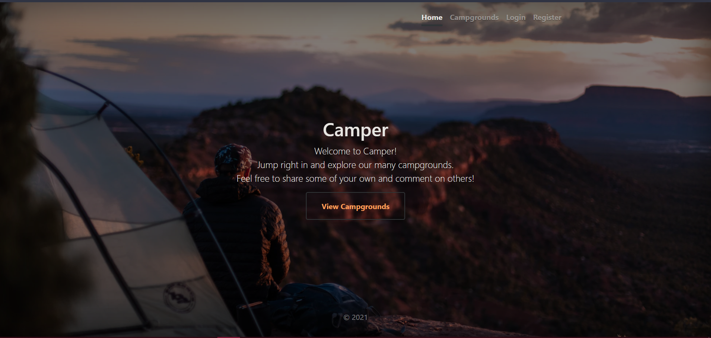
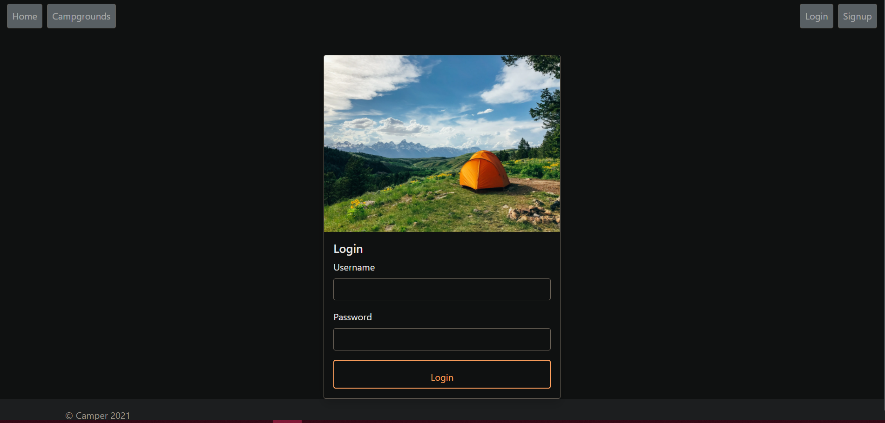
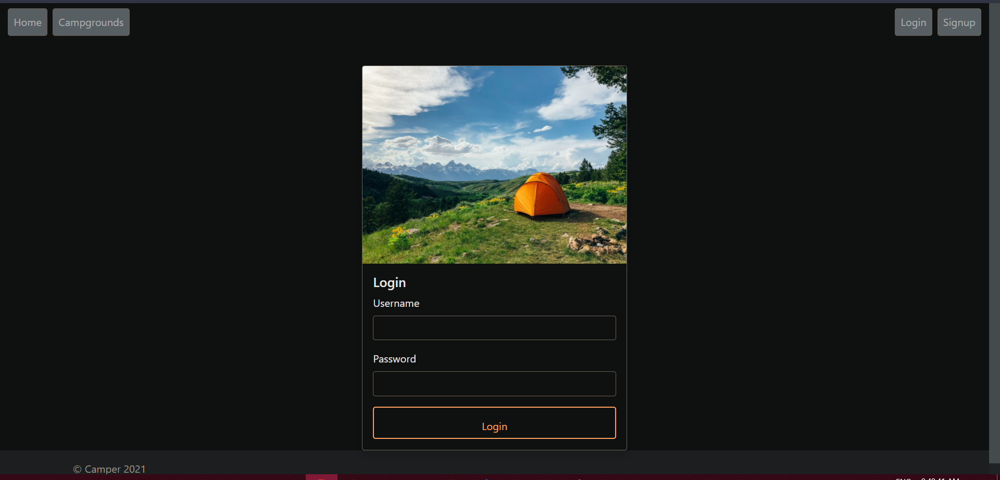

# Camper
A web app to view and review campgrounds all over the world. The app was built using javascript. The project was a good opportunity to practise the CRUD functionality, authentication and authorization. I also learnt to include and manage third party packages. The project was also a good opportunity for me to look at the security aspects of building a website and how to prevent cross site scripting,sanitizing HTML and use of “helmet” package.  
https://guarded-plains-61244.herokuapp.com/   
The project includes:
1) Interactive map cluster for all the camps   
2) User authentication and authorization     
3) Review system with animated star review   
4) System-wide Dark Theme   

 

 

 

 

 

 

 

